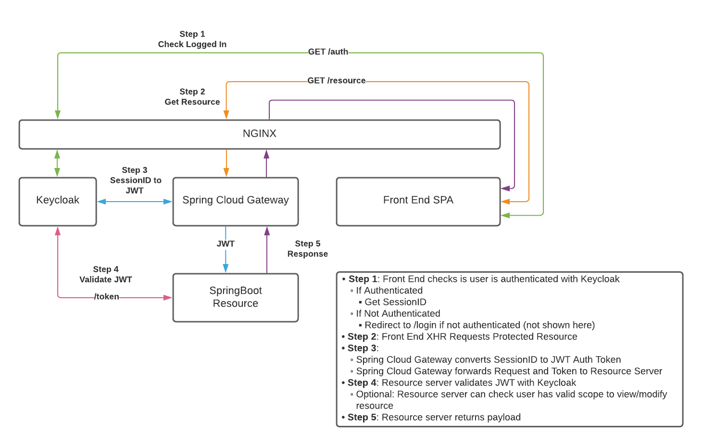

# keycloak-poc

## Start Running

This POC uses NGINX to prevent CORS/Cookie issues between Front End and Keycloak/Spring Gateway. NGINX may not be needed when deployed since all products will be on the same domain.

### Run Nginx and Keycloak w/ Postgres Backend

```bash
docker compose up
```

### Setup Keycloak

\*\* **first time only** \*\*

- Login to portal @ http://localhost:3050/auth
  - Credentials
  ```
  User: admin
  Password: Pa55w0rd
  ```

- Import Realm Configuration
  - Navigate to `Master Realm -> Import`
  - Upload `./realm-export.json` (skip on existing)
    - Note: It's been reported this doesn't work the first time. Try twice?
- Create User
  - Navigate to `Master Realm -> Users -> Create Users`
  - Enter any username and password (disable temp password)
- Generate Client Secret
  - Navigate to `Clients -> spring-with-test-scope -> Credentials -> Regenerate Sercet` in the
  - Update `client-secret` in `gateway/src/main/resources/application.yml` with generated secret
  - Note: There may be a way to script this but currently it doesn't get exported in the Realm Export

### Run SpringBoot Services
Use IDE or command line of your choice.
Project Directories
- gateway
- callme

### Run Front End

`cd` to `./front-end`

```bash
npm start
```

### Login to frontend @ http://localhost:3050

## Keycloak Flow

<p align="center">
  
</p>
